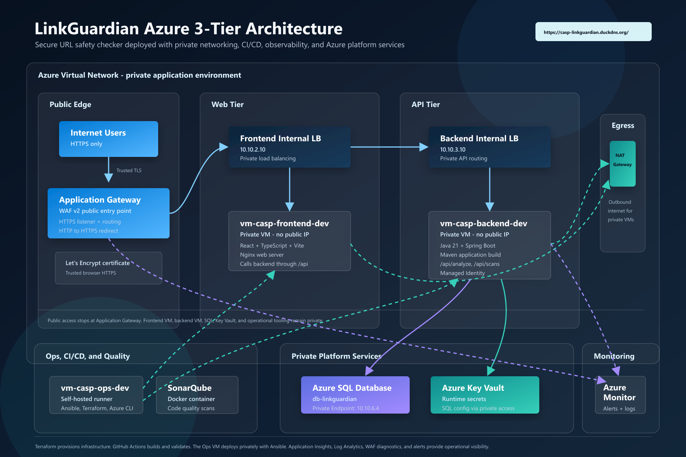

# Azure 3-Tier Architecture - LinkGuardian

> A production-style Azure deployment of a URL safety checker web application using private networking, Terraform, Ansible, GitHub Actions, SonarQube, Azure SQL, Key Vault, Application Gateway WAF v2, and Azure monitoring.

**LinkGuardian** is publicly available at:

```text
https://casp-linkguardian.duckdns.org/
```

The application is exposed publicly **only** through Azure Application Gateway WAF v2.
All compute, database, and secret-management resources stay private behind the Azure Virtual Network.

HTTPS is configured with a trusted **Let's Encrypt certificate**.

---

## Project Overview

**LinkGuardian** is a URL safety checker web application.

Users can paste a URL and receive a safety result based on backend URL analysis. The application helps identify suspicious, invalid, or potentially risky URLs using signals such as:

- URL format validity
- Suspicious patterns
- Typo-like domains
- Insecure protocol usage
- URL length
- Risky keywords
- Invalid or malformed inputs

The goal of this project is not only to build a working application.

The main goal is to demonstrate how a real application can be deployed in a secure, automated, monitored, and production-style Azure environment.

---

## Core DevOps Value

This project demonstrates how DevOps improves software delivery by making systems:

- Faster to release
- Safer to operate
- Easier to monitor
- More repeatable
- More cost-aware
- More secure by design
- Ready for future scaling

LinkGuardian is a simple user-facing application backed by serious cloud engineering.

---

## Architecture Overview

```text
Internet (HTTPS)
       |
       v
https://casp-linkguardian.duckdns.org/
       |
       v
Azure Application Gateway WAF v2
       |
       +----------------------------+
       |                            |
       v                            v
Frontend Internal LB          Backend Internal LB
10.10.2.10                    10.10.3.10
       |                            |
       v                            v
vm-casp-frontend-dev           vm-casp-backend-dev
React + TypeScript + Vite      Java 21 + Spring Boot
Nginx                          Maven
                                    |
                                    v
                            Azure SQL Database
                            Private Endpoint: 10.10.6.4

vm-casp-ops-dev
Ansible control node
GitHub self-hosted runner
SonarQube
Docker
Azure CLI
Terraform
Maven
Certbot certificate operations

Key Vault
Private access for runtime secrets

NAT Gateway
Outbound internet for private subnets without public VM IPs
```



---

## Azure Resources

| Resource | Name / Purpose |
| --- | --- |
| Resource Group | `rg-casp-dev` |
| Virtual Network | Private Azure network for all tiers |
| Frontend VM | `vm-casp-frontend-dev` |
| Backend VM | `vm-casp-backend-dev` |
| Ops VM | `vm-casp-ops-dev` |
| Frontend Internal Load Balancer | Private load balancing for frontend tier |
| Backend Internal Load Balancer | Private load balancing for backend tier |
| Application Gateway | WAF v2 public entry point |
| NAT Gateway | Outbound internet access for private subnets |
| Azure SQL Server | `sql-casplink-dev` |
| Azure SQL Database | `db-linkguardian` |
| SQL Private Endpoint | `10.10.6.4` |
| Key Vault | Stores runtime secrets |
| Log Analytics Workspace | `law-casp-dev` |
| Application Insights | Backend telemetry |
| Azure Monitor Alerts | CPU, SQL, and App Gateway health alerts |
| Action Group | `ag-casp-alerts` |

---

## Technology Stack

| Layer | Technology |
| --- | --- |
| Infrastructure as Code | Terraform |
| Configuration Management | Ansible |
| CI/CD | GitHub Actions |
| Frontend | React + TypeScript + Vite |
| Web Server | Nginx |
| Backend | Java 21 + Spring Boot + Maven |
| Database | Azure SQL |
| Secret Management | Azure Key Vault |
| Identity | Managed Identity |
| Code Quality | SonarQube |
| Monitoring | Azure Monitor + Application Insights + Log Analytics |
| Security | Application Gateway WAF v2 + NSGs + Private Endpoints + HTTPS |
| Domain | DuckDNS |
| TLS Certificate | Let's Encrypt |

---

## Frontend

The frontend is built with:

- React
- TypeScript
- Vite
- Nginx

The UI was designed with a premium **Apple-like / enterprise cybersecurity SaaS** style.

### Frontend Features

- Dark theme
- Light theme
- Vibrant startup / pitch-deck color system
- Glassmorphism cards
- Responsive mobile layout
- Loading state
- Error state
- Safe result state
- Suspicious result state
- Invalid result state
- Trust badges
- How-it-works section
- Scan history section
- Custom favicon
- Browser title: `Link Guardian`

### Frontend Behavior

The frontend communicates with the backend through Application Gateway path routing.

Main API paths:

```text
/api/analyze
/api/scans
/api/health
```

The frontend no longer calls `localhost`.
API requests are routed through the deployed public domain and forwarded privately to the backend tier.

Public frontend URL:

```text
https://casp-linkguardian.duckdns.org/
```

---

## Backend

The backend is built with:

- Java 21
- Spring Boot
- Maven
- Azure SQL integration

### Backend Endpoints

| Endpoint | Purpose |
| --- | --- |
| `/api/health` | API health check |
| `/health` | Alternative health check |
| `/api/analyze` | Analyze submitted URL |
| `/analyze` | Alternative analyze endpoint |
| `/api/scans` | Read scan history |
| `/scans` | Alternative scan history endpoint |

### URL Analysis

The backend analyzes submitted URLs and classifies them into result states such as:

- Safe
- Suspicious
- Invalid

Analysis can include checks for:

- Invalid input
- Missing or unsupported protocol
- Suspicious URL length
- Suspicious keywords
- Typo-like domain patterns
- Insecure HTTP usage
- Malformed URLs

### Persistence

Analyzed links are saved to Azure SQL.

Implemented backend components:

- `ScanResult` entity
- `ScanResultRepository`
- `ScanController`
- `AnalyzeController`
- `repository.save(...)` inside the analyze flow

### Scan History

When a URL is analyzed:

1. The backend receives the submitted URL.
2. The backend analyzes the URL.
3. The result is saved to Azure SQL.
4. The frontend can read previous scans through:

```text
/api/scans
```

This allows the application to display scan history in the UI.

---

## Database

Azure SQL is used as the application database.

| Setting | Value |
| --- | --- |
| SQL Server | `sql-casplink-dev` |
| Database | `db-linkguardian` |
| Private Endpoint | `10.10.6.4` |
| Public Network Access | Disabled |

The database is not publicly reachable.
The backend reaches SQL through private networking.

### SQL Secrets

Runtime SQL configuration is stored securely.

Required secret names:

```text
SQL-SERVER
SQL-DATABASE
SQL-USERNAME
SQL-PASSWORD
```

---

## Identity and Secrets

The backend VM uses Managed Identity:

```text
vm-casp-backend-dev managed identity
```

Security model:

- SQL secrets are stored securely
- Backend retrieves runtime configuration securely
- No hardcoded runtime secrets in the application
- Key Vault public access is disabled
- Access was configured through Key Vault access policy

---

## HTTPS and Domain Setup

The public domain is:

```text
https://casp-linkguardian.duckdns.org/
```

HTTPS is configured with a trusted **Let's Encrypt certificate**.

### Certificate Setup Process

To issue and attach the certificate:

1. DuckDNS was temporarily pointed to the Ops VM public IP.
2. Port `80` was temporarily opened on the Ops NSG.
3. Certbot was used to request a Let's Encrypt certificate.
4. The certificate was converted to PFX format.
5. The PFX certificate was uploaded to the Application Gateway HTTPS listener.
6. DuckDNS was pointed back to the Application Gateway public IP.
7. HTTP to HTTPS redirect was configured.

### Final HTTPS State

| Check | Status |
| --- | --- |
| Domain configured | Complete |
| Trusted HTTPS | Complete |
| Let's Encrypt certificate | Complete |
| HTTP to HTTPS redirect | Complete |
| Browser certificate warning removed | Complete |

---

## Security

Security was built into the architecture from the beginning.

### Implemented Security Controls

- Application Gateway WAF v2
- HTTPS with trusted Let's Encrypt certificate
- HTTP to HTTPS redirect
- Network Security Groups
- Private frontend and backend tiers
- Internal Load Balancers
- SQL Private Endpoint
- Key Vault secrets
- Managed Identity
- Key Vault public access disabled
- SQL public network access disabled
- No public access to backend or database
- No hardcoded GitHub secrets for runtime

### Security Principle

The user can reach the application publicly, but the application servers, database, and secrets remain private.

```text
Public access: Application Gateway only
Private access: frontend, backend, SQL, Key Vault, ops tooling
```

---

## Infrastructure Provisioning with Terraform

Terraform is used for infrastructure provisioning.

### Terraform Workflow

The infrastructure workflow includes:

- Terraform version check
- `terraform fmt`
- `terraform init`
- `terraform validate`
- `terraform plan`

### Terraform-Managed Resources

Terraform provisions or validates the core infrastructure, including:

- Resource Group
- Virtual Network and subnets
- Frontend VM
- Backend VM
- Ops VM
- Frontend Internal Load Balancer
- Backend Internal Load Balancer
- Application Gateway WAF v2
- NAT Gateway
- Azure SQL Server and Database
- SQL Private Endpoint
- Key Vault
- Log Analytics Workspace
- Application Insights
- Azure Monitor Alerts

---

## Configuration and Deployment with Ansible

Ansible is used for server configuration and application deployment.

### Ansible Inventory

```yaml
frontend:
  vm-casp-frontend-dev: 10.10.2.10

backend:
  vm-casp-backend-dev: 10.10.3.10

ops:
  vm-casp-ops-dev
```

### Ping Validation

Ansible connectivity was validated successfully:

| Host Group | Result |
| --- | --- |
| Frontend | SUCCESS |
| Backend | SUCCESS |
| Ops | SUCCESS |

### Playbooks

| Playbook | Purpose |
| --- | --- |
| `deploy-frontend.yml` | Deploy frontend build to Nginx |
| `deploy-backend.yml` | Deploy Spring Boot backend JAR |
| `deploy-sonarqube.yml` | Install and run SonarQube |

### Frontend Playbook

The frontend playbook:

- Installs Nginx
- Cleans `/var/www/html`
- Copies built `dist` files
- Restarts Nginx

### Backend Playbook

The backend playbook:

- Installs Java
- Copies backend JAR
- Creates or updates systemd service
- Restarts backend service

### SonarQube Playbook

The SonarQube playbook:

- Installs Docker
- Starts Docker
- Runs `sonarqube:community` container
- Exposes SonarQube on port `9000`

Manual Ansible deployments are working.

---

## CI/CD with GitHub Actions

GitHub Actions is used for CI/CD.

The Ops VM is connected as a GitHub self-hosted runner.

### Runner Model

| Runner Type | Purpose |
| --- | --- |
| GitHub-hosted runner | Build, test, and validation jobs |
| Self-hosted runner on Ops VM | Private deployment through Ansible |

This model is required because private VMs cannot be directly reached from public GitHub-hosted runners.

---

## Frontend Workflow

The frontend workflow performs:

- Checkout
- Setup Node.js 20
- `npm install`
- `npm run build`
- Ansible deployment to frontend VM

Status:

```text
Frontend CI/CD: Complete
```

---

## Backend Workflow

The backend workflow performs:

- Checkout
- Setup Java 21
- `mvn clean package`
- SonarQube scan
- Ansible deployment to backend VM

Status:

```text
Backend CI/CD: Complete
```

---

## Infrastructure Workflow

The infrastructure workflow performs:

- Terraform version check
- `terraform fmt`
- `terraform init`
- `terraform validate`
- `terraform plan`

Status:

```text
Infrastructure CI: Complete
```

---

## SonarQube

SonarQube runs on the Ops VM using Docker.

Access model:

```text
localhost:9000
```

For browser access, an SSH tunnel is used.

### GitHub Secrets

The following secrets were created and added to GitHub:

```text
SONAR_TOKEN
SONAR_HOST_URL
```

The backend workflow includes SonarQube scan before deployment.

SonarQube deployment was also added to Ansible.

---

## Monitoring and Logging

Monitoring was configured using:

- Log Analytics Workspace
- Application Insights
- Azure Monitor Alerts
- Application Gateway diagnostic logs

### Log Analytics Workspace

```text
law-casp-dev
```

### Backend Application Insights

Application Insights was connected to the backend.

Configuration steps:

- Azure Monitor Java agent downloaded
- `applicationinsights.json` created
- `-javaagent` added to the systemd `ExecStart`
- Live Metrics verified with real requests

### Application Gateway Diagnostics

The following logs and metrics were enabled:

- Access logs
- Firewall logs
- Performance logs
- AllMetrics

Log Analytics tables observed:

```text
AGWAccessLogs
AGWFirewallLogs
ApplicationGatewayAccess
```

### Alerts

Alerts were created through the Azure portal.

| Alert | Purpose |
| --- | --- |
| Backend VM CPU alert | Detect high backend CPU usage |
| SQL CPU alert | Detect high SQL utilization |
| App Gateway unhealthy host alert | Detect unhealthy backend pool members |

Action Group:

```text
ag-casp-alerts
```

Email notifications are sent through the action group.

---

## Validation

Use these checks to prove the system works end to end.

### Public Application

```bash
curl -I https://casp-linkguardian.duckdns.org/
```

### Backend Health Through Application Gateway

```bash
curl https://casp-linkguardian.duckdns.org/api/health
```

or:

```bash
curl https://casp-linkguardian.duckdns.org/health
```

### Analyze URL

```bash
curl -X POST https://casp-linkguardian.duckdns.org/api/analyze \
  -H "Content-Type: application/json" \
  -d '{"url":"https://github.com"}'
```

### Read Scan History

```bash
curl https://casp-linkguardian.duckdns.org/api/scans
```

### Internal Backend Health Check

From the backend VM:

```bash
curl http://localhost:8080/actuator/health
```

or:

```bash
curl http://localhost:8080/api/health
```

---

## Security Validation

Expected results:

| Check | Expected Result |
| --- | --- |
| Frontend VM public IP | None |
| Backend VM public IP | None |
| SQL public network access | Disabled |
| Key Vault public network access | Disabled |
| App Gateway WAF | Enabled |
| Public access path | Application Gateway only |
| SQL resolution | Private endpoint / private DNS |
| HTTPS certificate | Trusted Let's Encrypt |
| HTTP traffic | Redirects to HTTPS |

---

## End-to-End Functional Proof

The full application flow:

1. User opens `https://casp-linkguardian.duckdns.org/`
2. User submits a URL for analysis
3. Frontend calls backend through Application Gateway
4. Backend analyzes the URL
5. Backend saves scan result to Azure SQL
6. Frontend displays the result
7. Frontend can show scan history from `/api/scans`
8. Application telemetry appears in Application Insights / Log Analytics

---

## Problems Faced and Fixes

| Problem | Fix |
| --- | --- |
| Frontend was calling localhost API | Changed frontend API calls to `/api/analyze` |
| SCP deployment was hanging | Corrected VM/source/destination separation |
| App Gateway `/api` prefix rewrite issue | Added compatible backend endpoints |
| Backend JAR was outdated | Rebuilt and redeployed backend |
| Maven not found | Installed Maven |
| Terraform not found | Installed Terraform |
| Azure CLI not found | Installed Azure CLI |
| SSH public key missing | Added correct SSH public key |
| Workflow name confusion | Fixed workflow naming |
| YAML syntax error | Fixed workflow YAML syntax |
| Wrong Ansible path | Corrected Ansible paths |
| SonarQube access issue | Used Docker and SSH tunnel |
| Key Vault role assignment issue | Used access policy approach |
| Let's Encrypt standalone challenge failed | Temporarily pointed DuckDNS to Ops VM |
| Port 80 blocked for certificate challenge | Temporarily opened port 80 in Ops NSG |
| HTTPS browser warning | Installed trusted Let's Encrypt certificate on Application Gateway |
| HTTP still accessible | Added HTTP to HTTPS redirect |

---

## Current Status

| Area | Status |
| --- | --- |
| 3-tier Azure architecture | Complete |
| Domain | Complete |
| Real HTTPS | Complete |
| Frontend premium UI | Complete |
| Backend API | Complete |
| SQL write/read | Complete |
| Scan history | Complete |
| Key Vault + Managed Identity | Complete |
| CI/CD | Complete |
| Ansible | Complete |
| SonarQube | Complete |
| Terraform CI | Complete |
| Monitoring | Complete |
| Alerts | Complete |
| WAF | Complete |

---

## Remaining Polish

- Fully implement and test the final backend URL analyzer logic
- Polish the frontend scan history UI to match the final design
- Create a final access plan before removing Ops VM public IP
- Add final architecture diagram
- Add demo script
- Add screenshots folder
- Finalize presentation speech

---

## Suggested Repository Structure

```text
linkguardian/
├── .github/workflows/              # GitHub Actions workflows
├── backend/                        # Java Spring Boot backend
├── frontend/                       # React + TypeScript + Vite frontend
├── config/ansible/                 # Ansible inventory and playbooks
├── infra/terraform/                # Terraform infrastructure
├── docs/                           # Architecture, demo, screenshots, runbook
└── README.md
```

---

## Required GitHub Secrets / Variables

### Azure / Terraform

```text
AZURE_CLIENT_ID
AZURE_CLIENT_SECRET
AZURE_TENANT_ID
AZURE_SUBSCRIPTION_ID
```

### SQL / Application

```text
SQL-SERVER
SQL-DATABASE
SQL-USERNAME
SQL-PASSWORD
```

### SonarQube

```text
SONAR_TOKEN
SONAR_HOST_URL
```

---

## Demo Checklist

During the demo, show:

1. `https://casp-linkguardian.duckdns.org/` working in browser
2. Trusted HTTPS certificate
3. URL analyze result
4. Scan history
5. GitHub Actions frontend/backend workflows
6. SonarQube quality scan
7. Azure Application Gateway WAF
8. VM private networking / no public backend exposure
9. SQL Private Endpoint
10. Application Insights / Log Analytics / alerts

---

## Known Design Notes

- The web and API tiers sit behind internal load balancers.
- Application Gateway WAF v2 is the only public entry point.
- Frontend and backend VMs are private.
- Azure SQL is reachable through Private Endpoint only.
- Key Vault is used for runtime secrets.
- NAT Gateway provides outbound access for private subnets.
- The self-hosted runner is required because deployment targets are private.
- HTTPS is trusted through Let's Encrypt, not self-signed.
- The architecture is ready for future scale-out behind internal load balancers.

---

## Additional Documentation

| Document | Purpose |
| --- | --- |
| `docs/architecture-diagram.png` | Visual architecture diagram |
| `docs/demo-script.md` | Presentation and demo walkthrough |
| `docs/runbook.md` | Operations and troubleshooting |
| `docs/screenshots/` | Proof screenshots for submission/demo |
| `docs/presentation-plan.md` | Slide structure and speaking plan |
